## Conexión a bases de datos con JDBC o JPA - Temas a tratar

En esta clase se abordarán las siguientes temáticas:

- Java Data Base Connectivity (JDBC)
- ¿Qué son los ORM?
- Java Persistence API (JPA) + Hibernate
    - Annotations
    - CRUD: Create, read, update, delete


> ⚠️ **Advertencia:** Recuerda que para poder llevar con total normalidad esta clase debes tener conocimientos previos de BASES DE DATOS RELACIONALES y consultas SQL. En la sección 8 del Prebootcamp "Bases de Datos Relacionales", cuentas con el contenido complementario necesario.

---

## Java Data Base Connection (JDBC)

**JDBC**("Java Database Connectivity") es una API (Interfaz de Programación de Aplicaciones) de Java que permite interactuar con bases de datos relacionales. JDBC proporciona una forma estándar y orientada a objetos de acceder a bases de datos, lo que facilita la conexión, consulta, inserción, actualización y eliminación de datos en bases de datos desde una aplicación Java.

[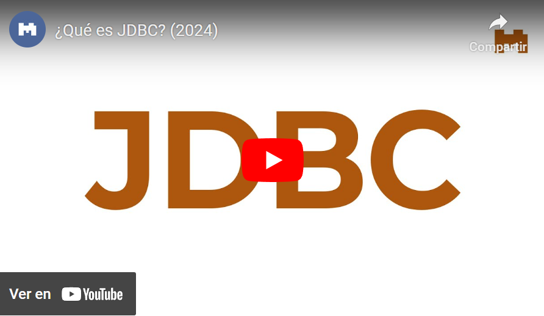](https://youtu.be/H9sN8KJYHkQ)

---

## ¿Cómo utilizar JDBC? Implementación paso a paso

Imaginemos que tenemos una clínica médica y deseamos utilizar JDBC en Java para gestionar información sobre los pacientes en una base de datos que utiliza MySQL como SGBD. En este ejemplo, asumiremos que ya hemos configurado una base de datos llamada "clinica" con una tabla llamada "pacientes" (previamente creados en nuestro SGBD).

### Paso 1: Establecer la conexión a la base de datos

Aquí, crearemos una clase que nos permita configurar y administrar la conexión a la base de datos. En ella, estableceremos la URL de la base de datos, el nombre de usuario y la contraseña necesarios para conectarse a la misma.

```java
public class JDBCExample {
    public static void main(String[] args) {
        String url = "jdbc:mysql://localhost:3306/clinica"; // URL de la base de datos "clinica"
        String usuario = "tu_usuario"; // Nombre de usuario de la base de datos
        String contraseña = "tu_contraseña"; // Contraseña de la base de datos

  //utilizamos excepciones para manejar posibles errores de conexión.
        try {
            Connection conexion = DriverManager.getConnection(url, usuario, contraseña);
        } catch (Exception e) {
            e.printStackTrace();
        }
    }
}
```

> ⚠️ **Advertencia:** Recuerda que para poder utilizar con normalidad estas clases, debes importar las siguientes librerías/bibliotecas:

```java
import java.sql.Connection;
import java.sql.DriverManager;
import java.sql.Statement;
import java.sql.ResultSet;
```

> ⚠️ **Advertencia:** De igual manera debes contar con la librería/biblioteca necesaria del driver de MySQL (SGBD que estamos utilizando en este momento). En caso de no encontrarlo o poder descargarlo con **Maven** te dejamos a continuación el link de descarga para hacerlo manualmente: **[Descargar MySqlConnector.jar](./resources/8_1-mysql-connector-j-8.1.0.jar)**

> **⚠️ Advertencia:** En caso de ayuda extra, puedes consultar este video de instalación o configuración de drivers: [https://youtu.be/barKl4ylEns?si=FwtQ8bmfF0XvRa1h](https://youtu.be/barKl4ylEns?si=FwtQ8bmfF0XvRa1h)


### Paso 2: Creamos una declaración SQL y ejecutamos una consulta para la tabla pacientes

En este paso, dentro de nuestro método _main_ (en este ejemplo, en otros casos en el lugar donde necesitemos), debemos crear una declaración SQL que consulte la base de datos para recuperar información sobre los pacientes. En este ejemplo, ejecutaremos una consulta _select_ para traer todos los datos de la tabla pacientes

```java
try {
    Connection conexion = DriverManager.getConnection(url, usuario, contraseña);
    Statement statement = conexion.createStatement();
    String sql = "SELECT * FROM pacientes"; // Cambia el nombre de la tabla a "pacientes"
    ResultSet resultado = statement.executeQuery(sql);
    
    // Procesa los resultados
    while (resultado.next()) {
        int id = resultado.getInt("id");
        String nombre = resultado.getString("nombre");
        int edad = resultado.getInt("edad");
        String diagnostico = resultado.getString("diagnostico");
        System.out.println("ID: " + id + ", Nombre: " + nombre + ", Edad: " + edad + ", Diagnóstico: " + diagnostico);
    }
    
    // Cierra la conexión y recursos
    resultado.close();
    statement.close();
    conexion.close();
} catch (Exception e) {
    e.printStackTrace();
}
```

> ⚠️ **Advertencia:** Para visualizar datos mediante el SELECT asegúrate de anteriormente haber cargado datos en la base de datos. 

> ⚠️ **Advertencia:** Al finalizar debemos asegurarnos siempre de cerrar adecuadamente la conexión y liberar recursos después de utilizarlos.

¡Y listo! Con esto ya podrías interactuar mediante JDBC con tu base de datos.

>💡**Nota:** Recuerda que así como utilizamos el SELECT en este ejemplo, también puedes probar con otras consultas que quieras ejecutar en tu base de datos.

---

## ¿Qué es un ORM?

**ORM (Object-Relational Mapping)** es una técnica de programación que permite mapear objetos en un lenguaje de programación, como Java, a estructuras de datos en una base de datos relacional. En otras palabras, un ORM facilita la interacción entre aplicaciones orientadas a objetos y bases de datos relacionales, abstrayendo gran parte de la complejidad de escribir consultas SQL y permitiendo a los desarrolladores trabajar con objetos y clases en lugar de tablas y registros de bases de datos.

[](https://youtu.be/2pNaYOBWxa0)

---

## JPA (Java Persistence API)

**Java Persistence API (JPA)** es una API estándar de Java que se utiliza para gestionar la persistencia de objetos en bases de datos relacionales. JPA proporciona un conjunto de especificaciones y estándares que facilitan el mapeo de objetos Java a tablas de base de datos y simplifican las operaciones de lectura, escritura y administración de datos en una base de datos.


### Proveedores de JPA

Existen varios proveedores de persistencia (implementaciones) para Java Persistence API (JPA), que son compatibles con la especificación JPA y proporcionan la funcionalidad necesaria para mapear objetos Java a bases de datos relacionales. Algunos de los proveedores de JPA más conocidos incluyen:

- **Hibernate:** Hibernate es uno de los proveedores de JPA más populares y ampliamente utilizados. Ofrece una amplia gama de funcionalidades, soporta mapeo objeto-relacional, y proporciona características avanzadas como caché de segundo nivel y búsqueda de texto completo.
    
- **EclipseLink:** EclipseLink es otra implementación de JPA ampliamente utilizada y es la referencia de JPA proporcionada por Eclipse Foundation. Es conocida por su alto rendimiento y soporte para características avanzadas, como mapeo de herencia y caché.
    
- **Apache OpenJPA:** OpenJPA es un proyecto de código abierto de la Apache Software Foundation que proporciona una implementación de JPA. Se enfoca en proporcionar una implementación de JPA de alto rendimiento y escalabilidad.
    
- **DataNucleus:** DataNucleus es una implementación de JPA que admite mapeo objeto-relacional y también se puede utilizar con otros modelos de persistencia, como NoSQL. Es conocida por su flexibilidad y la variedad de almacenes de datos compatibles.
    
- **ObjectDB:** ObjectDB es un proveedor comercial de JPA que se especializa en bases de datos orientadas a objetos. Ofrece un alto rendimiento y es compatible con JPA, lo que permite el uso de objetos Java directamente en la base de datos.
    
- **Blaze-Persistence:** Blaze-Persistence es un proyecto de código abierto que se basa en JPA y agrega características adicionales, como soporte para consultas avanzadas y generación de metamodelos mejorada.
    
- **TopLink:** TopLink fue una implementación de JPA desarrollada por Oracle, que más tarde se convirtió en EclipseLink. Aunque ha sido reemplazada por EclipseLink en las últimas versiones, algunas aplicaciones más antiguas aún pueden usar TopLink.
    
Es importante destacar que la elección de un proveedor de JPA depende de tus necesidades específicas, como el rendimiento, las características avanzadas, la compatibilidad con bases de datos específicas y la preferencia personal.

> ⚠️ **Advertencia:** Existe una confusión muy común a que JPA y Hibernate son conceptos o tecnologías diferentes y esto no es así. Hibernate es un Proveedor de JPA, por lo que es una forma de implementar dicha tecnología.


### Modelo de capas

Para poder implementar **JPA** de manera correcta en nuestros proyectos de **Java**, es necesario que contemos con una estructura de carpetas/paquetes bien establecida. Para ello, existen diferentes modelos a seguir; sin embargo dos de los más utilizados son el MVC (que veremos más adelante) y el Modelo de Capas, el cual te sugerimos utilizar actualmente.

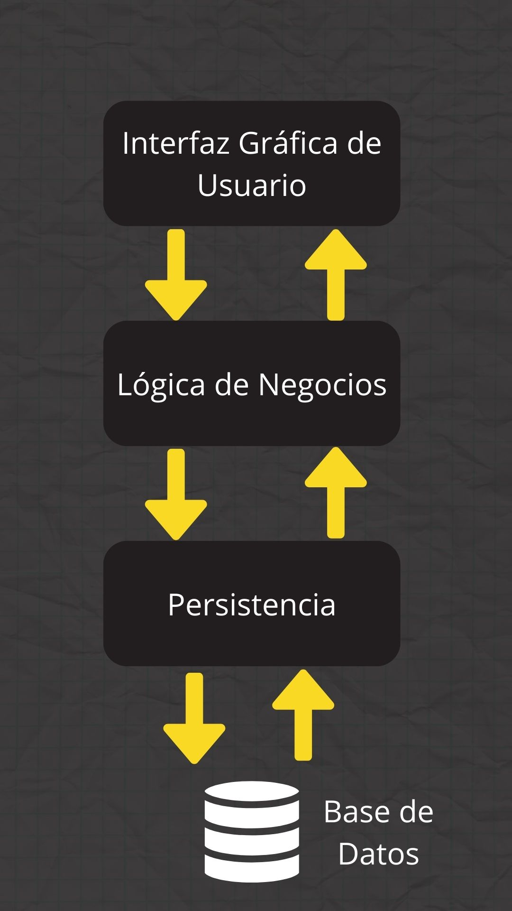

Para entender el modelo de capas y su implementación, te dejamos a continuación un video explicativo:

[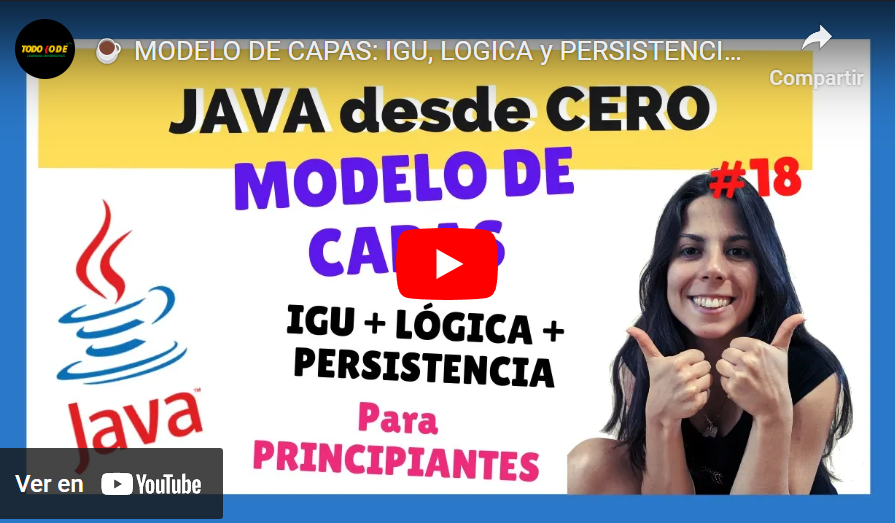](https://youtu.be/C6J0TOlCieM)

---

## Configurando JPA

### MySQL Connection

> ⚠️ **Advertencia:** Para llevar a cabo las siguientes configuraciones utilizaremos como IDE Netbeans. Esto se debe a que permite implementar las configuraciones de bases de datos de manera gratuita, mientras que en Intellij Idea, no es posible de forma sencilla mediante su versión Community (gratuita).

- Paso 1: Abrir nuestro SGBD y crear una base de datos. En este caso crearemos una llamada pruebajpa
    
- Paso 2: Creamos un nuevo proyecto **CON MAVEN** en Netbeans
    
- Paso 3: Crear una nueva conexión de base de datos en la pestaña Services en nuestro proyecto de Netbeans mediante click derecho y New Connection

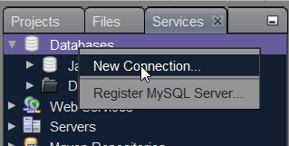

- Paso 4: Debemos configurar nuestro conector de MySQL. Por defecto es probable que no lo tengas configurado, por lo que podrás descargarlo desde esta [URL](./resources/8_1-mysql-connector-j-8.1.0.jar)

Una vez descargado lo vamos a agregar en Netbeans de la siguiente manera:

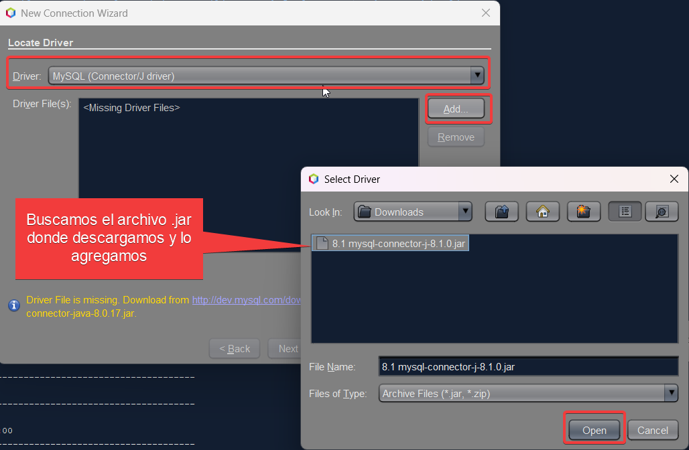

Una vez agregado le damos a next y procederemos a configurar los datos de nuestra base de datos:

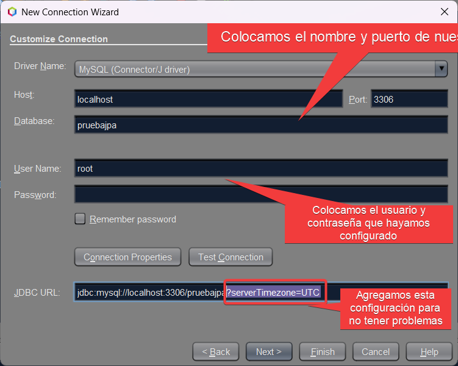

Una vez todo esto configurado, procederemos a dar click en finish y... ¡Listo! ¡Finalizada la configuración de conexión!

> ⚠️ **Advertencia:** Recuerda que debes tener abierto tu servidor o SGBD y que debe existir previamente tu base de datos con los datos que hayas configurado.


### Unidad de Persistencia

Una **unidad de persistencia (Persistence Unit)** a es una configuración que define cómo una aplicación Java interactúa con una base de datos utilizando tecnologías de persistencia, como por ejemplo Java Persistence API (JPA). Podemos imaginarla como una "caja" que contiene toda la información importante sobre cómo los objetos que creemos en nuestra aplicación Java se van a almacenar en una base de datos.

De manera sencilla, una unidad de persistencia especifica:

- **La fuente de datos:** Indica a qué base de datos se conectará la aplicación para almacenar y recuperar datos.
    
- **Las clases de entidades:** Enumera las clases Java que representan tablas en la base de datos. Estas clases se conocen como "entidades".
    
- **La configuración de JPA:** Define cómo se mapean las clases Java a las tablas de la base de datos y cómo se administran las transacciones.
    
- **Las propiedades de conexión:** Incluye detalles como la URL de conexión, el nombre de usuario y la contraseña para acceder a la base de datos.


#### Creación de una Persistence Unit (Unidad de Persistencia)

Para crear la PU hacemos click derecho en nuestro proyecto >> new >> Other >> Persistence >> Persistence Unit

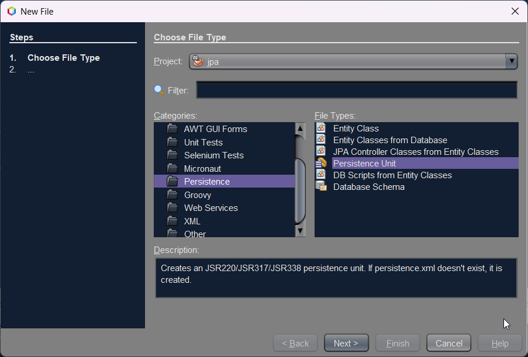

Damos click en Next y pasaremos a elegir un nombre para nuestra PU, en este caso pondremos el nombre jpaPU y seleccionamos la conexión de base de datos que creamos anteriormente.


Una vez hecho esto, hacemos click en finish y ya tenemos nuestra Persistence Unit creada. Si todo salió bien, tendremos una nueva carpeta llamada META-INF y dentro un archivo llamado persistence.xml con el siguiente formato:

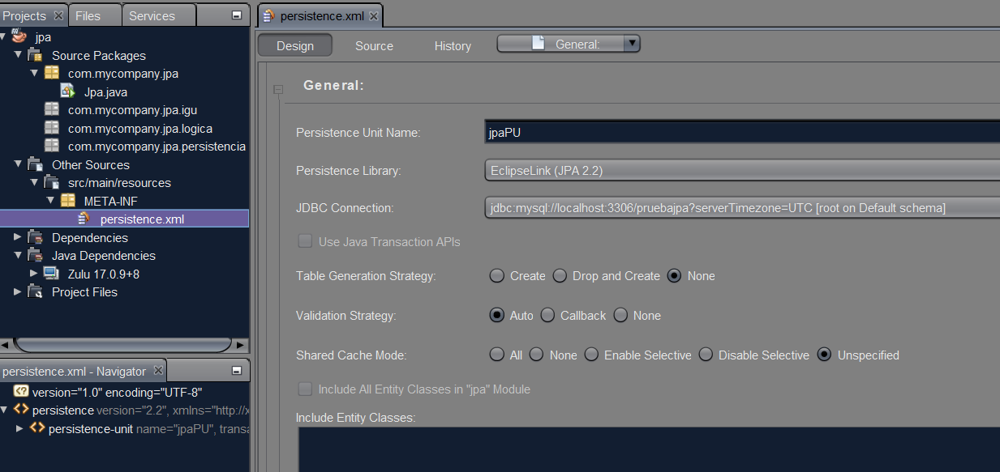


[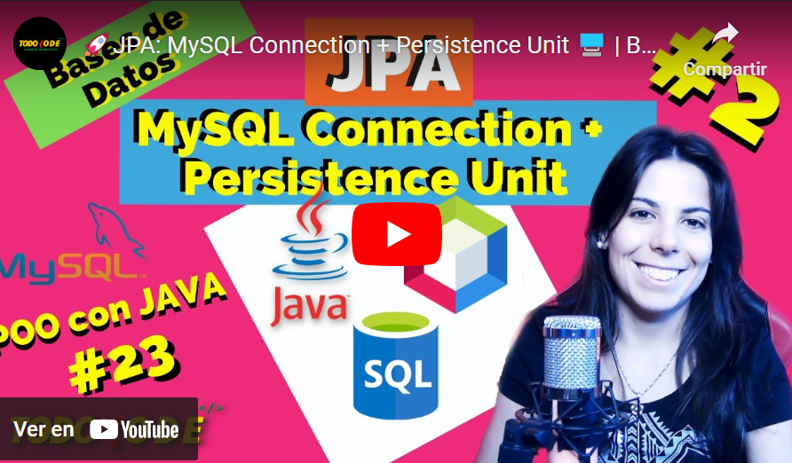](https://youtu.be/KGzOP__3GjA)

### Annotations en JPA

Las anotaciones en el contexto de la programación son metadatos especiales que se incorporan en el código fuente de un programa para proporcionar información adicional y directrices sobre cómo se debe procesar ese código. Estas anotaciones son utilizadas por el compilador, herramientas de desarrollo y tiempo de ejecución para realizar diversas tareas, como la generación de código, la verificación de tipos, la configuración de la aplicación y más.

Java Persistence API (JPA) utiliza anotaciones para mapear clases de objetos Java a tablas de bases de datos y para proporcionar información sobre cómo gestionar la persistencia de los objetos. EclipseLink es uno de los proveedores de JPA y soporta un conjunto de anotaciones que son estándar en JPA.

Aquí tienes una explicación de algunas de las principales anotaciones utilizadas en JPA con EclipseLink (proveedor que utilizaremos en esta oportunidad):

- **@Entity:** Esta anotación se utiliza para marcar una clase Java como una entidad, lo que significa que la clase representa una tabla en la base de datos. Cada instancia de esta clase corresponde a una fila en la tabla.
    
- **@Table:** Puede ser utilizada para personalizar la tabla de base de datos asociada a una entidad. Puedes especificar el nombre de la tabla, el esquema y otras opciones de configuración de la tabla.
    
- **@Id:** Esta anotación se utiliza para marcar una propiedad de una clase como la clave primaria de la entidad. Cada entidad debe tener una clave primaria única.
    
- **@GeneratedValue:** Se utiliza junto con la anotación @Id para especificar cómo se generará automáticamente el valor de la clave primaria. Puedes usar estrategias como IDENTITY, SEQUENCE, TABLE, entre otras.
    
- **@Column:** Se utiliza para personalizar la asignación entre una propiedad de la entidad y una columna de la tabla. Puedes especificar detalles como el nombre de la columna, su tipo de datos, y si permite nulos.

**¡Veamos el ejemplo de una clase Persona mapeada con Annotations!**

>💡 **Recordatorio:** La clase persona debe estar creada dentro del paquete "logica" (o model).

```java
import javax.persistence.Entity;
import javax.persistence.Id;
import javax.persistence.GeneratedValue;
import javax.persistence.GenerationType;

@Entity
public class Persona {
    @Id
    @GeneratedValue(strategy = GenerationType.IDENTITY)
    private Long id;
    private String nombre;
    private int edad;

    // Constructor por defecto
    public Persona() {}

    // Constructor con parámetros
    public Persona(String nombre, int edad) {
        this.nombre = nombre;
        this.edad = edad;
    }

    // Getters y Setters para las propiedades
    public Long getId() {
        return id;
    }

    public String getNombre() {
        return nombre;
    }

    public void setNombre(String nombre) {
        this.nombre = nombre;
    }

    public int getEdad() {
        return edad;
    }

    public void setEdad(int edad) {
        this.edad = edad;
    }
}
```

>💡 **Recordatorio:** GenerationType nos indica el tipo de generación automática que queremos para nuestra Id. Además de Identity (que vemos en el ejemplo) también existen otros tipos. 
>
>Veamos en detalle cada uno de ellos:
>
>	- **GenerationType.IDENTITY:** Este valor indica que la generación de la clave primaria se basa en la identidad de la base de datos. En general, se utiliza con bases de datos que admiten la generación automática de claves primarias, como MySQL con columnas AUTO_INCREMENT o PostgreSQL con columnas SERIAL.
>	  
>	- **GenerationType.SEQUENCE:** Se utiliza para indicar que la generación de la clave primaria se basa en una secuencia de base de datos preexistente. Esto es común en bases de datos como Oracle, donde se crea una secuencia para generar valores únicos.
>	  
>	- **GenerationType.TABLE:** Con esta estrategia, se utiliza una tabla de base de datos especial para generar valores únicos. Esta estrategia puede ser útil en bases de datos que no admiten secuencias o identidades.
>	  
>	- **GenerationType.AUTO:** Este valor permite que el proveedor JPA elija automáticamente la estrategia de generación más adecuada según la base de datos subyacente. Puede variar según el proveedor de JPA que estés utilizando.
>	 
>	- **GenerationType.NONE:** Indica que no se generará automáticamente ningún valor para la clave primaria. El valor debe ser proporcionado manualmente en el código antes de la inserción en la base de datos.


### Actualización Unidad de Persistencia

Una vez todo mapeado y listo, debemos agregar nuestra clase entidad a nuestra unidad de persistencia. Para ello vamos a: Other sources >> src/main/resources >> META-INF >> persistence.xml

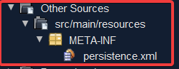

Una vez allí, hacemos click en Add Class y agregamos nuestra/as clase/s entidad/es:

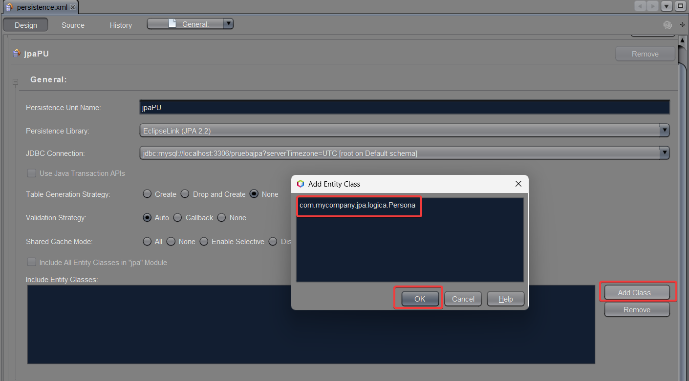

> ⚠️ **Importante:** Recuerda que dentro de nuestro archivo persistence.xml debemos seleccionar la opción "Create" dentro de Table Generation Strategy, tal como se especifica en la siguiente imagen:
> 
> 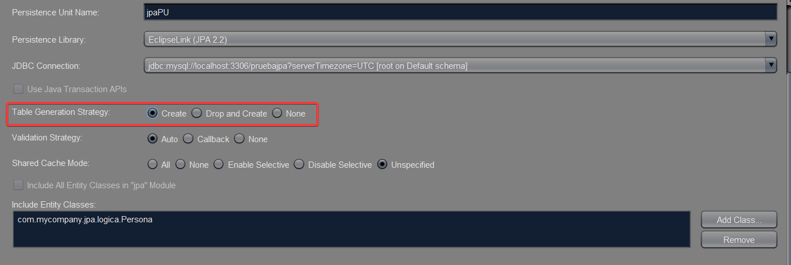

Con eso tenemos todo listo y bien configurado (Por ahora 😉)


### JPA Controllers

Los controladores JPA (Java Persistence API) son componentes que se utilizan en aplicaciones Java empresariales para gestionar la interacción con la capa de persistencia de la base de datos. Estos controladores se utilizan comúnmente en aplicaciones basadas en JPA para realizar operaciones CRUD (Crear, Leer, Actualizar, Eliminar) en las entidades de la base de datos.

Los controladores JPA facilitan la gestión de la persistencia en aplicaciones Java, ya que encapsulan la lógica de acceso a la base de datos y brindan una interfaz sencilla para realizar operaciones en las entidades.

¡Veamos cómo crearlos y configurarlos!


#### Creación de un JPA Controller

- **Paso 1:** Antes de crear los JPA Controllers debemos asegurarnos que nuestra clase de la cual crearemos el controlador cumpla con las siguientes características:
    - Cuente con la annotation **@Entity** bien definida
    - Cuente con Getters y Setters (¡Esto es realmente crucial!) Si todo esto está correctamente establecido, procederemos a crear nuestro JpaController.

>💡 **Recordatorio:** Recuerda que todas las clases correspondientes a la persistencia (JPA) las incorporaremos en el paquete correspondiente PERSISTENCIA.

- **Paso 2:** Click derecho en el paquete persistencia >> new >> Other >> Persistence >> JpaController from Entity Classes

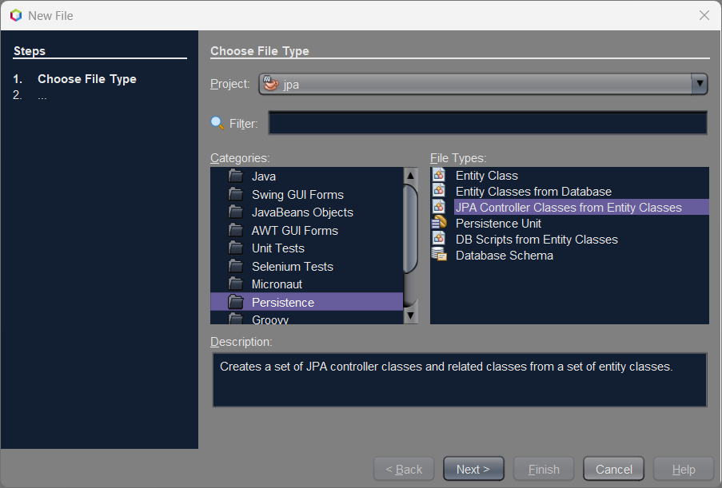

- **Paso 3:** Damos click a next, luego en la siguiente pantalla agregamos nuestras clases entidad (en este caso solo Persona) y luego damos nuevamente a next


- Paso 4: Seleccionamos el paquete (siempre recuerden utilizar el paquete destinado a la persistencia para una buena separación de capas) y damos click a finish.

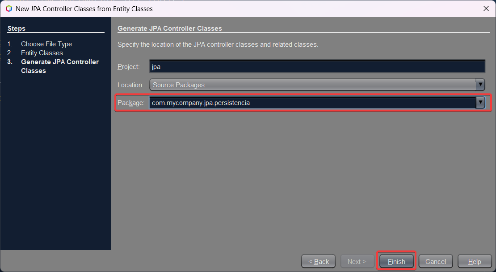

Si todo sale bien, nuestra estructura de paquetes de nuestro proyecto ahora se verá de la siguiente manera:

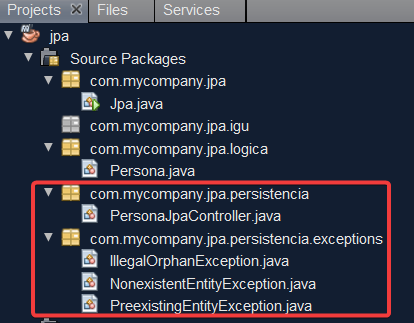

Y en el paquete de persistencia tendremos creada nuestro JpaController para Persona, que debería verse de la siguiente manera con código autogenerado:

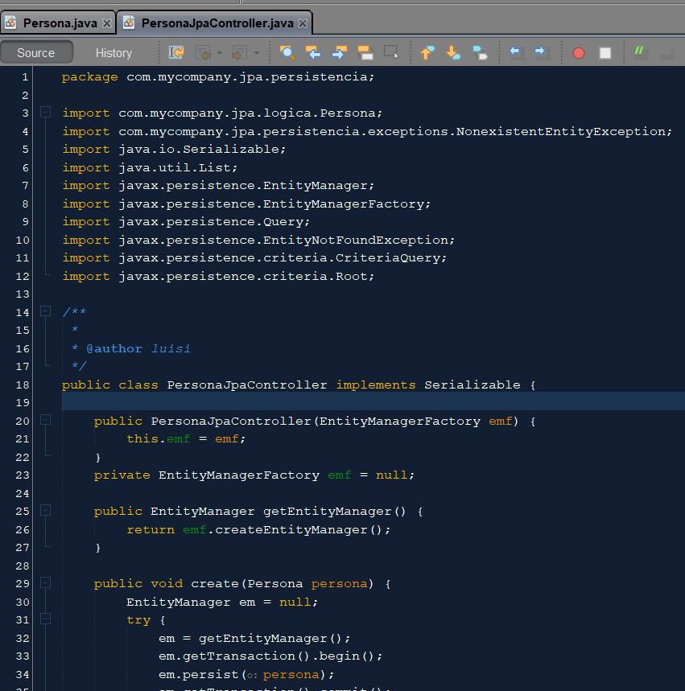

- **Paso 5:** Una vez creado nuestro JpaController tenemos que crear un constructor en dicha clase para poder acceder al administrador de entidades (EntityManager). Para ello agregamos la siguiente porción de código donde entre paréntesis colocaremos el nombre de nuestra unidad de persistencia.

>💡 **Recordatorio:** Recuerda que el nombre de la unidad de persistencia se encuentra en el archivo persistence.xml dentro de la carpeta META-INF

```java
public PersonaJpaController() {
  emf = Persistence.createEntityManagerFactory("jpaPU");
}
```

- **Paso 6:** Si seguimos el modelo de capas, éste establece que cada capa tiene que tener su clase "Controladora". Por lo que crearemos en el paquete persistencia la clase "ControladoraPersistencia" para cumplir con esto de la siguiente manera:

```java
package com.mycompany.jpa.persistencia;

public class ControladoraPersistencia {
  
  PersonaJpaController persoJPA = new PersonaJpaController();
  
}
```

Con esto, estamos en condiciones de probar si se crea nuestra tabla "persona" en nuestra base de datos. Para ello, creamos provisoriamente la siguiente línea de código en nuestra clase _main_:

```java
public class Jpa {

  public static void main(String[] args) {
      
      ControladoraPersistencia controlPersis = new ControladoraPersistencia();
      
      
  }
}
```

Y por último, para importar nuestro driver de mysql en nuestro proyecto, agregamos la siguiente línea de código en el archivo pom.xml que lo encontramos en Project Files >> pom.xml

```java
  <dependency>
        <groupId>mysql</groupId>
        <artifactId>mysql-connector-java</artifactId>
        <version>8.0.26</version> 
  </dependency>
```

Una vez hecho, pedimos a Maven que descargue las dependencias, haciendo click derecho en Dependencies >> Download sources

>💡 **Recordatorio:** _El archivo **pom.xml** es una parte fundamental de un proyecto basado en Maven. La sigla "POM" significa "Project Object Model", que en español se traduce como "Modelo de Objeto de Proyecto". Este archivo XML contiene información y configuración esencial incluyendo dependencias, plugins, metadatos, configuración de construcción y más sobre el proyecto._ Ejecutamos nuestra aplicación y si todo sale bien, se creará la correspondiente tabla en nuestra BD.

**¿Aún te quedaron dudas? Te dejamos un video explicativo de referencia para que puedas replicarlo**

[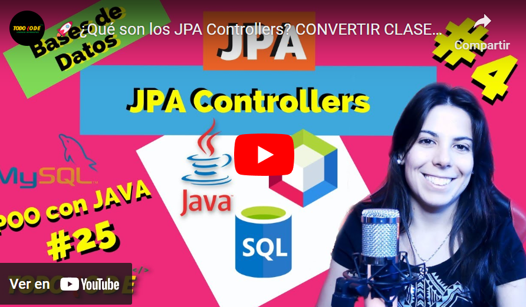](https://youtu.be/Z0BOz4wh1zg)
Si quieres ver el código más de cerca, te dejamos un proyecto de ejemplo funcionando en [este link](./resources/7-ejemploJpa.zip)

---

## CRUD con JPA

**CRUD** es un acrónimo que se utiliza comúnmente en el desarrollo de software para describir las cuatro operaciones básicas de manipulación de datos en una aplicación o sistema:

- **Crear (Create):** La operación "C" se refiere a la capacidad de crear nuevos registros o elementos en una base de datos o sistema. En el contexto de una base de datos, esto implica agregar una nueva fila a una tabla. En una aplicación, puede implicar crear nuevos objetos o instancias de una clase.
    
- **Leer (Read):** La operación "R" se refiere a la capacidad de leer, recuperar o consultar datos existentes de una base de datos o sistema. Esto implica obtener información de registros o elementos ya existentes sin realizar cambios en ellos.
    
- **Actualizar (Update):** La operación "U" implica la capacidad de modificar o actualizar datos existentes en una base de datos o sistema. Puede implicar cambiar los valores de campos o propiedades en registros o elementos existentes.
    
- **Eliminar (Delete):** La operación "D" se refiere a la capacidad de eliminar registros o elementos de una base de datos o sistema. Esto implica la eliminación permanente de datos que ya no son necesarios o deseados.

También es muy común encontrar este concepto con las siglas **ABML (Altas Bajas Modificaciones y Lecturas)** que serían el equivalente en español.


### CREATE

La operación "Create" en el contexto de JPA (Java Persistence API) implica crear nuevos registros en una base de datos a partir de objetos Java. CREATE cuenta con un método especial (con el mismo nombre) dentro del JpaController de cada clase que hayamos mapeado.


### **¡Veamos un ejemplo de cómo utilizarlo!**

- **Paso 1:** Crearemos en nuestra controladora de persistencia un método para cada operación CRUD, donde se reciban los parámetros necesarios de la persona (o clase en cuestión) desde el main o nuestra lógica para pasarlo al JPAController y convertirlo luego en un registro de la BD.

```java
package com.mycompany.jpa.persistencia;
import com.mycompany.jpa.logica.Persona;
import com.mycompany.jpa.persistencia.exceptions.NonexistentEntityException;
import java.util.List;
import java.util.logging.Level;
import java.util.logging.Logger;

public class ControladoraPersistencia {
  
  PersonaJpaController persoJPA = new PersonaJpaController();
  
  public void crearPersona(Persona pers) {
      persoJPA.create(pers);
  }
  
  public void borrarPersona(Long id) {
      try {
          persoJPA.destroy(id);
      } catch (NonexistentEntityException ex) {
          Logger.getLogger(ControladoraPersistencia.class.getName()).log(Level.SEVERE, null, ex);
      }
  }
  
  public List<Persona> traerPersonas () {
      return persoJPA.findPersonaEntities();
  }
  
  public void modificarPersona (Persona pers) {
  
      try {
          persoJPA.edit(pers);
      } catch (Exception ex) {
          Logger.getLogger(ControladoraPersistencia.class.getName()).log(Level.SEVERE, null, ex);
      }
    }
  }
```

- **Paso 2:** Creamos en nuestra clase Main un nuevo objeto de tipo persona

```java
package com.mycompany.jpa;

import com.mycompany.jpa.logica.Persona;
import com.mycompany.jpa.persistencia.ControladoraPersistencia;

public class Jpa {

public static void main(String[] args) {
    
    ControladoraPersistencia controlPersis = new ControladoraPersistencia();

 //recuerda que como es un Long se especifica con una L mayúscula a la derecha
    Persona pers  = new Persona (1L, "Luisina", 32);
}
}
```

- **Paso 3:** Probamos llamar al método **_crearPersona_** de la controladora de persistencia para que llame luego al método _create_ del Jpa Controller y de esta manera se produzca el alta en la BD nuestra persona en cuestión.

```java
    //creamos una persona en la BD
    controlPersis.crearPersona(pers);
```

Si todo sale bien, al ejecutar el programa obtendremos el siguiente resultado en nuestra base de datos:

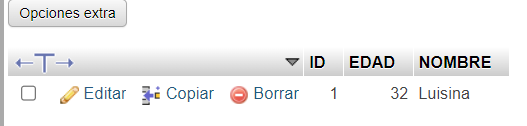

Si quieres ver más sobre el método CREATE te dejamos un video explicativo de refuerzo a continuación:

[](https://youtu.be/TPysm6EXOuM)

### DESTROY Y EDIT

El método **destroy** se utiliza para eliminar una entidad específica de la base de datos. Elimina permanentemente el registro asociado en la tabla correspondiente. Por otro lado, el método **edit** se utiliza para actualizar los datos de una entidad existente en la base de datos. Permite modificar los valores de los campos de la entidad sin eliminarla ni crear una nueva.

Ahora agreguemos al _main_ de nuestro proyecto una nueva operación de alta, para luego eliminar el registro en cuestión y modifiquemos la edad del registro que agregamos anteriormente de la siguiente manera:

```java
        
        ControladoraPersistencia controlPersis = new ControladoraPersistencia();
        
        //recuerda que como es un Long se especifica con una L mayúscula a la derecha
        Persona pers  = new Persona (1L, "Luisina", 32);
        
        //creamos una persona en la BD
        controlPersis.crearPersona(pers);
        
        controlPersis.crearPersona(new Persona (2L, "Prueba borrar", 23));
        controlPersis.crearPersona(new Persona (3L, "Otro más", 35));
        
        //borramos el registro "Prueba Borrar" mediante su id (en este caso sería la 2)
        
        controlPersis.borrarPersona(2L);
        
        //editamos el primer registro cambiando la edad
        //antes era 32 ahora será 31
        pers.setEdad(31);
        controlPersis.modificarPersona(pers); 
    }
}
```

Si todo sale bien, así se vería nuestra base de datos:


>💡 **Recordatorio:** Por motivos prácticos para el ejercicio estamos utilizando la ID como parámetro y seteándola de forma manual. De todos modos, la ID se genera de forma automática gracias al Generation Type que seleccionamos.

Si quieres ver más sobre éstos dos métodos te dejamos un video explicativo de refuerzo a continuación:

[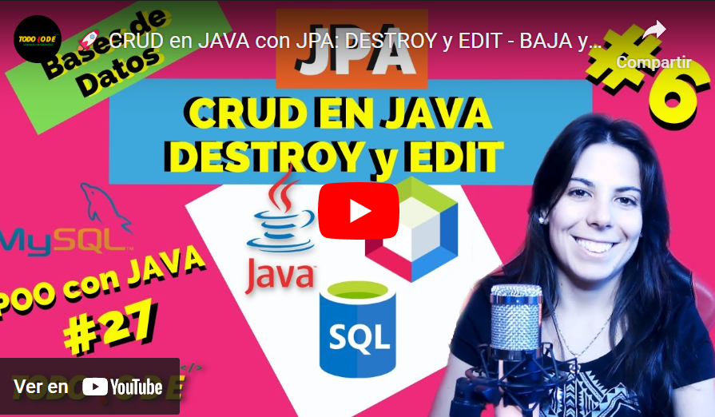](https://youtu.be/QwM6KHjCunk)

### FIND Y FIND ENTITIES

El método **find** se utiliza para recuperar un registro específico de la base de datos a través de su identificador o clave primaria.

El método findEntities se utiliza para recuperar todos los registros de una determinada tabla permitiéndonos almacenar en algún tipo de Collection (generalmente listas).

Probemos ver en el _main_ todos los registros de nuestra base de datos mediante find agregando lo siguiente:

```java
//mostrar todas las personas de la tabla mediante find entities
List<Persona> listaPersonas = controlPersis.traerPersonas();

//usando for each para recorrer la collection
System.out.println("----Lista de personas----");
for (Persona per:listaPersonas) {
	System.out.println(per.toString());
}
```

>💡 **Recordatorio:** Si tienes problemas o errores durante las diferentes ejecuciones, puedes optar por borrar únicamente la tabla de tu base de datos y dejar que JPA la vuelva a crear de forma automática cuando ejecutes el programa.

Si todo sale bien, podrás ver este resultado por consola:

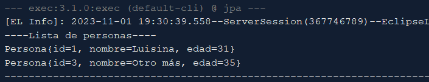

¿Te quedaron dudas? Te dejamos el siguiente video de referencia:

[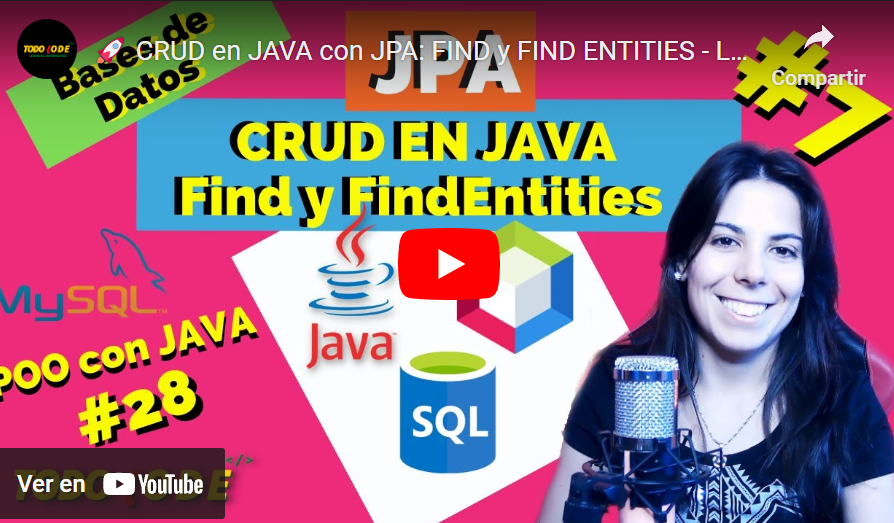](https://youtu.be/sPlR5zzBNr8)

### Resolución

Si deseas ver el código de ejemplo/resolución, te dejamos a continuación un proyecto completo con sus respectivas configuraciones.

[Descargar Código completo](./resources/7-jpaCompleto.zip)